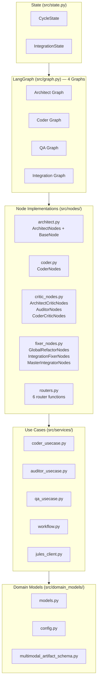
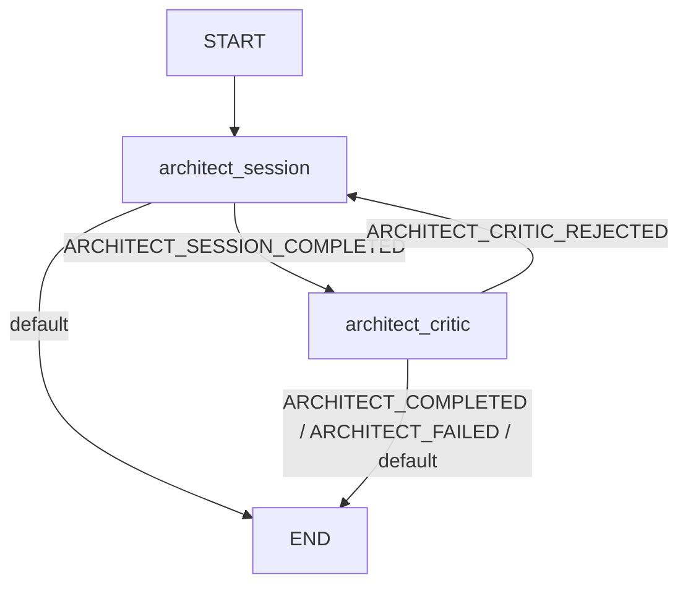
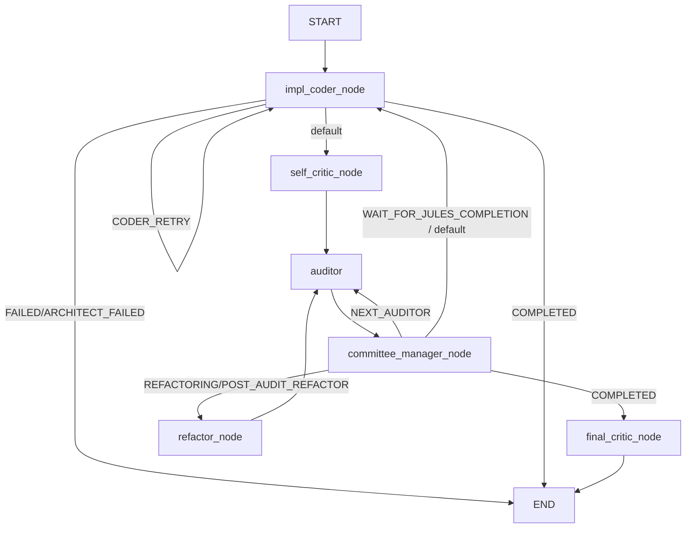
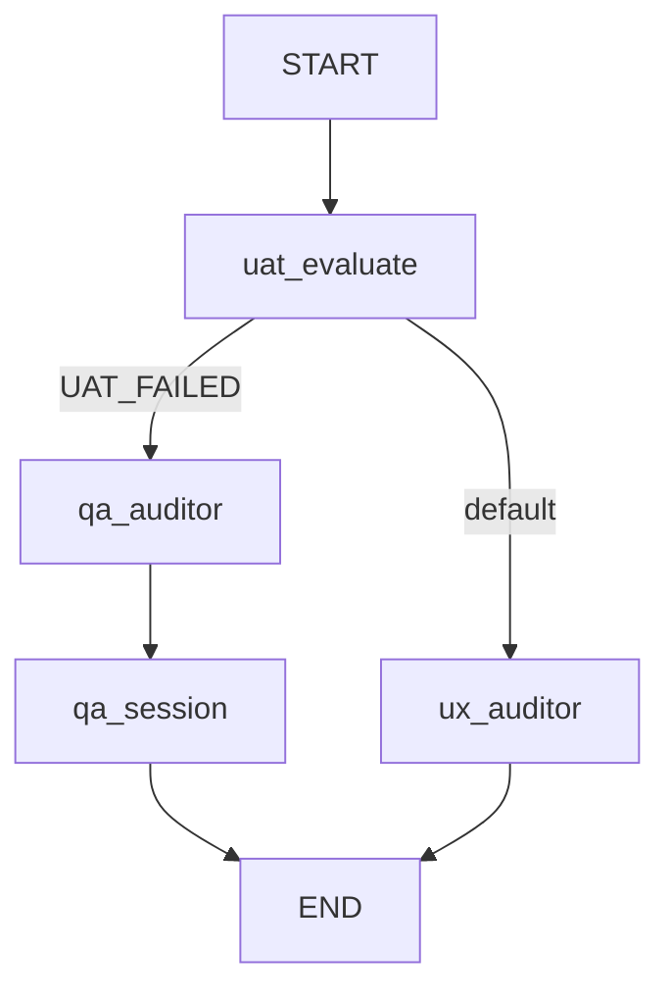
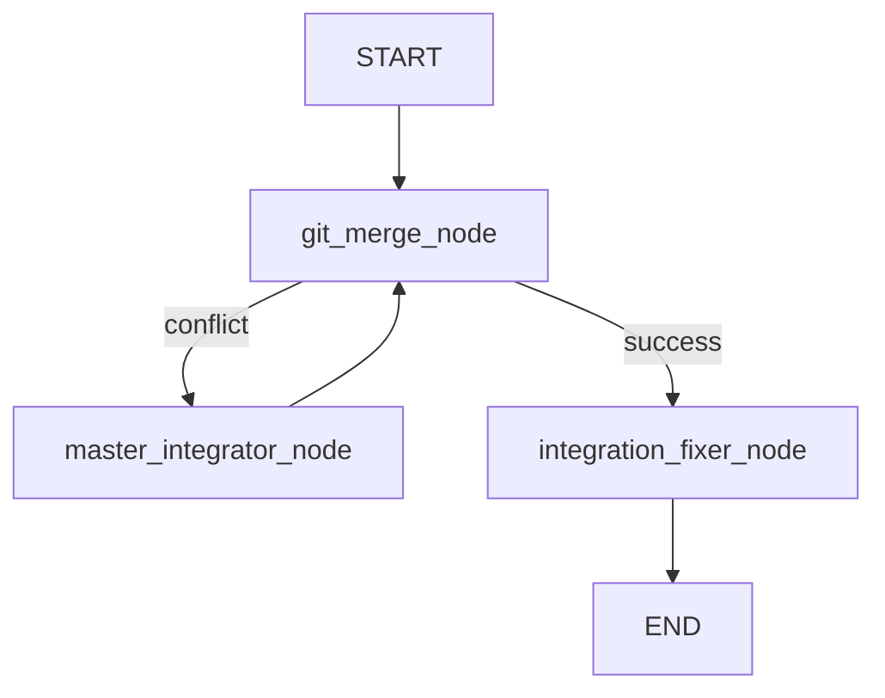
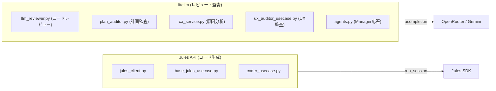
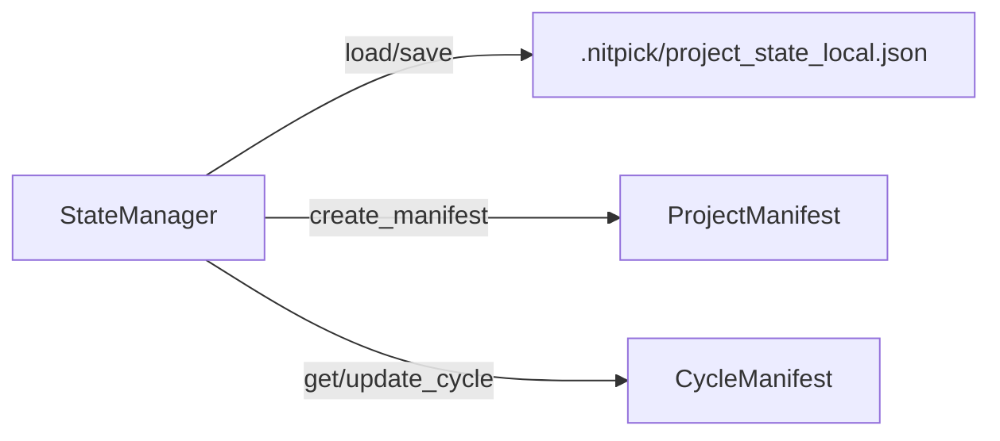

# Nitpickers2 アーキテクチャ概要

> 生成日: 2026-06-27
> ソースファイル数: 63 (templates除く)
> テスト数: 107

---

## 1. 全体レイヤー構成



---

## 2. LangGraph フロー図

### 2.1 Architect Graph

**ファイル**: [`src/graph.py:25`](../src/graph.py:25)

**ルーター**: [`route_architect_session`](../src/nodes/routers.py:59), [`route_architect_critic`](../src/nodes/routers.py:66)



**ノード**:
- `architect_session`: Julesセッション開始 + アーキテクチャ生成
- `architect_critic`: 自己批判評価。リジェクトされるとsessionにフィードバックループ

**状態**: シンプル。最大1回のcriticループ。

---

### 2.2 Coder Graph

**ファイル**: [`src/graph.py:58`](../src/graph.py:58)

**ルーター**: [`check_coder_outcome`](../src/nodes/routers.py:8), [`route_committee`](../src/nodes/routers.py:27)



**ノード (5)**:
- `impl_coder_node`: Julesのコード生成セッション
- `self_critic_node`: コード自己批評
- `auditor_node`: AIレビューア監査
- `committee_manager_node`:  CommitteeUseCase — 監査結果に基づくルーティング判断
- `refactor_node`: グローバルリファクタリング (AST分析)
- `final_critic_node`: 最終批評

**ルーティング複雑性**: committee_nodeが4方向に分岐。`current_phase`と`status`の組み合わせで決定。

---

### 2.3 QA Graph

**ファイル**: [`src/graph.py:111`](../src/graph.py:111)

**ルーター**: [`route_qa`](../src/nodes/routers.py:51)



**ノード (4)**:
- `uat_evaluate`: UATテスト実行
- `qa_auditor`: QA監査 (失敗時のみ)
- `qa_session`: チュートリアル生成
- `ux_auditor`: UX監査

---

### 2.4 Integration Graph

**ファイル**: [`src/graph.py:137`](../src/graph.py:137)

**ルーター**: [`route_merge`](../src/nodes/routers.py:77)



**ノード (3)**:
- `git_merge_node`: ブランチマージ実行
- `master_integrator_node`: コンフリクト解決ループ
- `integration_fixer_node`: マージ後の論理エラー修正

---

## 3. 状態管理

### 3.1 CycleState (主要)

**ファイル**: [`src/state.py:146`](../src/state.py:146)

```
CycleState
├── cycle_id: str (必須, バリデーション付き)
├── current_phase: WorkPhase (INIT / ARCHITECT / CODER / SELF_CRITIC / AUDIT / REFACTORING / FINAL_CRITIC / QA)
├── status: FlowStatus | None
├── error: str | None
│
├── committee: CommitteeState (監査状態)
│   ├── current_auditor_index, current_auditor_review_count
│   ├── iteration_count, audit_attempt_count
│   ├── fallback_count, anti_patterns_memory
│   └── is_refactoring
│
├── session: SessionPersistenceState (セッション永続化)
│   ├── jules_session_name, pr_url, project_session_id
│   ├── feature_branch, integration_branch
│   └── resume_mode, critic_retry_count
│
├── audit: AuditState (監査結果)
│   ├── audit_result, audit_feedback
│   ├── audit_pass_count, audit_retries
│   └── last_audited_commit
│
├── test: TestState (テスト結果)
│   ├── structural_report, test_logs
│   └── tdd_phase
│
├── uat: UATState (UAT状態)
│   ├── uat_analysis, uat_execution_state
│   ├── current_fix_plan, uat_retry_count
│   └── ux_audit_report
│
└── config: ConfigurationState (設定)
    ├── planned_cycle_count, requested_cycle_count
    └── planned_cycles
```

### 3.2 IntegrationState

**ファイル**: [`src/state.py:446`](../src/state.py:446)

```
IntegrationState
├── branches_to_merge: list[str]
├── master_integrator_session_id: str | None
├── unresolved_conflicts: list[ConflictRegistryItem]
├── conflict_status: str | None
└── status: str | None
```

---

## 4. ファイル構成 (63 files)

```
src/
├── __init__.py
├── agents.py              # LLM agent関数 (litellm統一)
├── cli.py                 # CLIエントリポイント
├── config.py              # 設定 (737行, 要整理)
├── enums.py               # FlowStatus, WorkPhase
├── graph.py               # 4 LangGraph定義
├── graph_nodes.py         # CycleNodes (全node委譲)
├── hash_utils.py
├── messages.py
├── process_runner.py
├── service_container.py   # DIコンテナ
├── state.py               # CycleState, IntegrationState
├── state_manager.py       # ファイルベース状態永続化
├── utils.py
├── validators.py
│
├── domain_models/         (4 files)
│   ├── __init__.py
│   ├── models.py          # 全コアモデル集約
│   ├── config.py          # 設定系モデル
│   └── multimodal_artifact_schema.py
│
├── nodes/                 (5 files)
│   ├── __init__.py
│   ├── architect.py       # BaseNode + ArchitectNodes
│   ├── coder.py           # CoderNodes
│   ├── critic_nodes.py    # 3 critic統合
│   ├── fixer_nodes.py     # 3 fixer統合
│   └── routers.py         # 6 router関数
│
├── services/              (30 files ★最大)
│   ├── __init__.py
│   ├── artifacts.py
│   ├── ast_analyzer.py
│   ├── async_dispatcher.py
│   ├── audit_orchestrator.py
│   ├── auditor_usecase.py
│   ├── base_jules_usecase.py
│   ├── coder_usecase.py
│   ├── committee_usecase.py
│   ├── conflict_manager.py
│   ├── contracts.py
│   ├── environment_validator.py
│   ├── file_ops.py
│   ├── git_ops.py
│   ├── git/               (6 files ★mixin過剰)
│   ├── integration_usecase.py
│   ├── jules_client.py
│   ├── jules/             (2 files)
│   ├── llm_reviewer.py
│   ├── plan_auditor.py
│   ├── project.py
│   ├── qa_usecase.py
│   ├── rca_service.py
│   ├── refactor_usecase.py
│   ├── self_critic_evaluator.py
│   ├── tracing.py
│   ├── uat_usecase.py
│   ├── ux_auditor_usecase.py
│   └── workflow.py        (1041行)
│
└── templates/             (29 MD files)
    ├── ARCHITECT_INSTRUCTION.md
    ├── CODER_INSTRUCTION.md
    ├── PLAN_AUDITOR_*.md
    ├── RCA_*.md
    └── ... (全プロンプト外部化)
```

---

## 5. LLM呼び出し経路



**統一状況**: litellm一本化完了 (pydantic-ai削除)

---

## 6. 状態永続化



**単一永続化**: SessionManager削除済み。StateManagerのみ。

---

## 7. テスト構成 (107 tests)

```
tests/
├── unit/                  (106 tests)
│   ├── test_graph_structure.py    # 4グラフの構造テスト
│   ├── test_routers.py            # 6ルーターの全分岐テスト
│   ├── test_state.py              # CycleStateバリデーション
│   └── test_graph_nodes.py        # CycleNodes interface
│
├── integration/           (3 tests)
│   ├── test_coder_graph.py
│   └── test_tracing_integration.py
│
├── e2e/                   (live tests, デフォルトskip)
│   └── ...
```

---

## 8. 残課題

| # | 課題 | 優先度 | 規模 |
|---|------|--------|------|
| 1 | **git/ 6ファイル統合** → git_ops.pyに一本化 | 🟡 中 | 970行 |
| 2 | **QA系usecase統合** (qa + uat + ux_auditor) | 🟡 中 | 3→1 |
| 3 | **jules/ 2ファイル統合** → jules_client.pyに | 🟢 低 | 2→0 |
| 4 | **workflow.py分割** (1041行) | 🔴 高 | 機能別分割 |
| 5 | **config.py整理** (737行) | 🟡 中 | 設定/Utility分離 |
| 6 | **Coder Graph committee分岐** の整理 | 🟢 低 | 要分析 |
