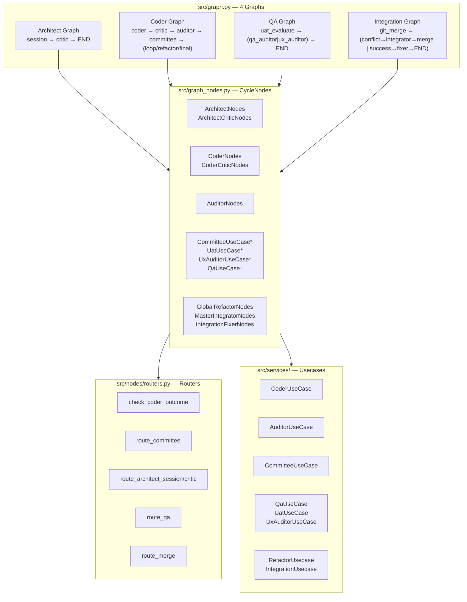

# 引き継ぎ資料

## セッション概要

**日時**: 2026-06-28 (Session 3)
**目的**: WorkflowService 分割、ドキュメント整備、デッドコード除去

---

## 前回からの変更サマリー

### A. セッション1 (前々回) の成果

- **JULES SDK → stdio MCP 化** の実現可能性調査
- **Phase 0 クリーンアップ**: `AgentProtocol` 定義、`JulesClient` リファクタリング、`MasterIntegratorClient` 分離
- 詳細: [`plans/jules-mcp-architecture.md`](plans/jules-mcp-architecture.md), [`plans/jules-cleanup-analysis.md`](plans/jules-cleanup-analysis.md)

### B. セッション2 (前回) の成果

#### B1. LangGraph 脆弱性修正

| # | 問題 | 修正内容 | ファイル |
|---|---|---|---|
| C1 | `integration_fixer_node` 未接続 | Integration Graph で `success` → `integration_fixer_node` → `END` に接続 | [`graph.py:181`](src/graph.py:181) |
| C2 | QA graph の lambda ルーター | `route_qa()` を QA graph 用に修正し lambda を置換 | [`routers.py:63`](src/nodes/routers.py:63) |
| M1 | 未使用ルーター (`route_auditor`, `route_final_critic`, `route_coder_critic`) | 削除 + `IGraphNodes` インターフェース整理 | [`routers.py`](src/nodes/routers.py) |
| M2 | `ArchitectNodes` 冗長バリデーション | `getattr` チェック削除 (Protocol が保証) | [`graph.py:30`](src/graph.py:30) |

#### B2. ファイル統合 (7ファイル削減)

| 削除したファイル | 移行先 |
|---|---|
| `src/nodes/committee.py` | `graph_nodes.py` (インライン化) |
| `src/nodes/uat.py` | `graph_nodes.py` (インライン化) |
| `src/nodes/ux_audit.py` | `graph_nodes.py` (インライン化) |
| `src/nodes/qa.py` | `graph_nodes.py` (インライン化) |
| `src/state_validators.py` | `state.py` (関数を直接定義) |
| `src/utils_json.py` | `utils.py` |
| `src/utils_sanitization.py` | `utils.py` |

#### B3. DI 修正

- `CommitteeUseCase` / `UatUseCase` / `UxAuditorUseCase` / `QaUseCase`: **per-call 生成 → `__init__` で一度保持**
- `CycleNodes.__init__`: `ServiceContainer.default()` → DI パラメータ化
- `JulesClient()` fallback: 全削除 (`workflow.py` 3箇所, `refactor_usecase.py`, `graph_nodes.py`)
- 型チェーン: `JulesClient` → `AgentProtocol` (Protocol による構造的サブタイピング)

### C. セッション3 (今回) の成果

#### C1. WorkflowService 分割 (1041行→50行)

| # | ファイル | 行数 | 責務 |
|---|---|---|---|
| W1 | `workflow_orchestrator.py` | 202行 | パイプライン統括 |
| W2 | `workflow_cycle.py` | 119行 | サイクル実行+Worktree |
| W3 | `workflow_session.py` | 85行 | セッション管理 |
| W4 | `workflow_archive.py` | 83行 | アーカイブ |
| W5 | `workflow_failure.py` | 72行 | 障害診断 |
| W6 | `workflow_quality.py` | 56行 | 品質ゲート |
| WF | `workflow.py` (Facade) | 19行 | Mixin継承 + `__init__` |

**方式**: Mixin継承 + Facadeパターン。`from src.services.workflow import WorkflowService` 維持。
**テスト**: 全111テスト通過。

#### C2. デッドコード除去

| # | 削除内容 | ファイル |
|---|---|---|
| D1 | `coder_critic_node` メソッド削除 (未使用、`self_critic_node`/`final_critic_node` と重複) | `graph_nodes.py:92` |
| D2 | `mock_global_sandbox` 参照削除 (存在しない属性への参照) | `tests/e2e/test_integration_graph.py:57` |
| D3 | 古いコメント削除 (`global_sandbox_node` 参照) | `tests/integration/test_integration_graph.py:101` |

#### C3. ドキュメント整備

| # | ドキュメント | 更新内容 |
|---|---|---|
| Doc1 | `plans/current-architecture.md` | ファイル数・行参照・テスト構成・残課題を最新化 |
| Doc2 | `plans/depth-complexity-analysis.md` | 発見1/2を ✅ 対応済みに、CycleState行参照修正 |
| Doc3 | `plans/handover.md` | Session 3 の成果を追記、完了タスクを ✅ に |

---

#### B4. 発見・修正した隠れバグ (Session 2)

| # | 問題 | 影響 | 修正 |
|---|---|---|---|
| 🐛 B1 | `CommitteeState` に `is_refactoring` フィールド未定義 | `global_refactor.py` で設定しても Pydantic が**サイレントドロップ** — `route_committee` で `is_refactoring` が常に `False`、リファクタリングパスが絶対に通らない | [`state.py:28`](src/state.py:28) にフィールド追加 |
| 🐛 B2 | `ArchitectNodes.jules: AgentProtocol` → Pydantic クラッシュ | Protocol クラスは `isinstance` 検証で `SchemaError` | [`architect.py:18`](src/nodes/architect.py:18) `jules: Any` |
| 🐛 B3 | `_send_message` (private) → `send_message` (public) | `AgentProtocol` にない private メソッドを呼び出し | [`qa_usecase.py:42`](src/services/qa_usecase.py:42), [`architect.py:135`](src/nodes/architect.py:135) |

---

## 現在のアーキテクチャ



`*` = 今回インライン化したクラス (直接 usecase を保持)

---

## テスト状況 (2026-06-28 Session 3 時点)

```
tests/unit/ .......................................... 106/106 PASS
tests/integration/test_coder_graph.py ............... 1/1 PASS
tests/integration/test_tracing_integration.py ....... 2/2 PASS
tests/integration/test_git_robustness.py ............ 1/1 PASS
tests/e2e/test_coder_graph.py ....................... 2/2 PASS
tests/e2e/test_architect_graph.py ................... 3/3 PASS
tests/e2e/test_qa_graph.py ......................... 2/2 PASS
tests/e2e/test_integration_graph.py ................. 1/1 PASS ✅ 復旧
-----------------------------------------------------
合計 (live除く) ................................... 118/118 PASS
```

全4グラフに構造テスト + 実行時テストあり。`test_integration_graph.py` の `mock_global_sandbox` 問題を修正し復旧。

### 既知の事前存在エラー (2026-06-28 確認)

| ファイル | エラー | 状態 |
|---|---|---|
| `src/utils.py` | `BaseCallbackHandler` has type `Any` | 未修正 |
| `src/services/base_jules_usecase.py:33` | `FlowStatus.AUDIT_FAILED` 不存在 (enumに定義なし) | ⚠️ 未修正 — `enums.py` に `AUDIT_FAILED` 追加が必要 |
| `src/config.py` | `BaseSettings` has type `Any` | 未修正 |
| `src/services/llm_reviewer.py` | Returning `Any` from function declared to return `bool` | 未修正 |
| ~~`tests/e2e/test_integration_graph.py:57`~~ | ~~`mock_global_sandbox` 参照~~ | ✅ Session 3 で修正 |

---

## 次回着手推奨タスク

> **更新 (2026-06-28)**: Session 3 で WorkflowService 分割・デッドコード除去完了。以降の優先順位を再評価。

### P1: `src/services/jules_client.py` 整理 (658行)

**問題**: 監視ループ、プラン監査、問い合わせ応答が1クラスに混在。

**改善案**:
- `JulesClient` — API呼び出しのみ
- 監視ループを分離 (例: `SessionWatcher`)

### P2: QA系3usecase統合 (qa + uat + ux_auditor → 1ファイル)

**問題**: 3ファイルに分かれているが、すべてQA Graphのノードとして連携。

### P3: `critic_retry_count >= 0` の死コード修正 (`critic_nodes.py:49`)

**問題**: 常にTrueのためcriticループが機能しない。`>= 0` → `>= 1` に修正が必要。

### 中期的課題 (未着手)

| 課題 | 優先度 | 備考 | 状態 |
|---|---|---|---|
| `MemorySaver` → 永続チェックポインタ (`SqliteSaver`) | 🟠 中 | プロセス再起動で LangGraph 状態消失 | 未着手 |
| ノードメソッド内の `MasterIntegratorClient()` 直接生成 | 🟡 低 | `master_integrator_node` のみ残存 | 未着手 |
| `critic_retry_count >= 0` の死コード (`critic_nodes.py:49`) | 🟡 中 | Flow-complexity分析で指摘 | ⚠️ 未修正 |
| `FlowStatus.AUDIT_FAILED` 未定義 (`base_jules_usecase.py:33`) | 🟡 中 | enumに定義追加が必要 | ⚠️ 未修正 |


---

## 関連ドキュメント

| ドキュメント | 説明 |
|---|---|
| [`plans/jules-mcp-architecture.md`](plans/jules-mcp-architecture.md) | MCP 化の全体設計・ツール定義・移行計画 |
| [`plans/jules-cleanup-analysis.md`](plans/jules-cleanup-analysis.md) | JulesClient の問題洗い出しとクリーンアップ詳細 |
| [`plans/workflow-split-plan.md`](plans/workflow-split-plan.md) | WorkflowService 分割の設計書 |
| [`plans/current-architecture.md`](plans/current-architecture.md) | 最新アーキテクチャ概要 |
| [`plans/handover.md`](plans/handover.md) | **このファイル** — 引き継ぎ資料 |
