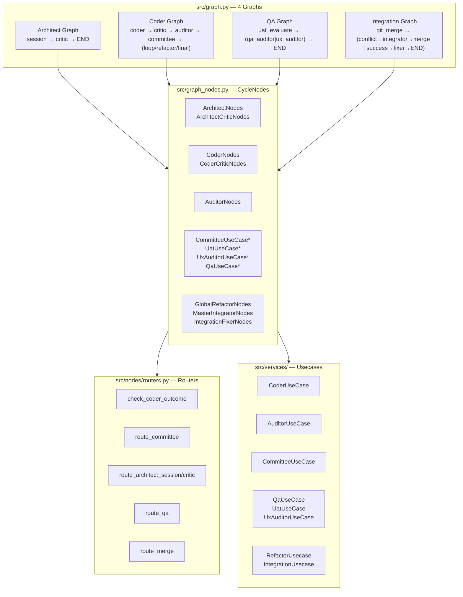

# 引き継ぎ資料

## セッション概要

**日時**: 2026-06-27 (Session 2)
**目的**: LangGraph 構造の脆弱性修正、ファイル統合、DI 統一、バグ修正

---

## 前回からの変更サマリー

### A. セッション1 (前回) の成果

- **JULES SDK → stdio MCP 化** の実現可能性調査
- **Phase 0 クリーンアップ**: `AgentProtocol` 定義、`JulesClient` リファクタリング、`MasterIntegratorClient` 分離
- 詳細: [`plans/jules-mcp-architecture.md`](plans/jules-mcp-architecture.md), [`plans/jules-cleanup-analysis.md`](plans/jules-cleanup-analysis.md)

### B. セッション2 (今回) の成果

#### B1. LangGraph 脆弱性修正

| # | 問題 | 修正内容 | ファイル |
|---|---|---|---|
| C1 | `integration_fixer_node` 未接続 | Integration Graph で `success` → `integration_fixer_node` → `END` に接続 | [`graph.py:181`](src/graph.py:181) |
| C2 | QA graph の lambda ルーター | `route_qa()` を QA graph 用に修正し lambda を置換 | [`routers.py:63`](src/nodes/routers.py:63) |
| M1 | 未使用ルーター (`route_auditor`, `route_final_critic`, `route_coder_critic`) | 削除 + `IGraphNodes` インターフェース整理 | [`routers.py`](src/nodes/routers.py) |
| M2 | `ArchitectNodes` 冗長バリデーション | `getattr` チェック削除 (Protocol が保証) | [`graph.py:30`](src/graph.py:30) |

#### B2. ファイル統合 (7ファイル削減)

| 削除したファイル | 移行先 |
|---|---|
| `src/nodes/committee.py` | `graph_nodes.py` (インライン化) |
| `src/nodes/uat.py` | `graph_nodes.py` (インライン化) |
| `src/nodes/ux_audit.py` | `graph_nodes.py` (インライン化) |
| `src/nodes/qa.py` | `graph_nodes.py` (インライン化) |
| `src/state_validators.py` | `state.py` (関数を直接定義) |
| `src/utils_json.py` | `utils.py` |
| `src/utils_sanitization.py` | `utils.py` |

#### B3. DI 修正

- `CommitteeUseCase` / `UatUseCase` / `UxAuditorUseCase` / `QaUseCase`: **per-call 生成 → `__init__` で一度保持**
- `CycleNodes.__init__`: `ServiceContainer.default()` → DI パラメータ化
- `JulesClient()` fallback: 全削除 (`workflow.py` 3箇所, `refactor_usecase.py`, `graph_nodes.py`)
- 型チェーン: `JulesClient` → `AgentProtocol` (Protocol による構造的サブタイピング)

#### B4. 発見・修正した隠れバグ

| # | 問題 | 影響 | 修正 |
|---|---|---|---|
| 🐛 B1 | `CommitteeState` に `is_refactoring` フィールド未定義 | `global_refactor.py` で設定しても Pydantic が**サイレントドロップ** — `route_committee` で `is_refactoring` が常に `False`、リファクタリングパスが絶対に通らない | [`state.py:28`](src/state.py:28) にフィールド追加 |
| 🐛 B2 | `ArchitectNodes.jules: AgentProtocol` → Pydantic クラッシュ | Protocol クラスは `isinstance` 検証で `SchemaError` | [`architect.py:18`](src/nodes/architect.py:18) `jules: Any` |
| 🐛 B3 | `_send_message` (private) → `send_message` (public) | `AgentProtocol` にない private メソッドを呼び出し | [`qa_usecase.py:42`](src/services/qa_usecase.py:42), [`architect.py:135`](src/nodes/architect.py:135) |

---

## 現在のアーキテクチャ



`*` = 今回インライン化したクラス (直接 usecase を保持)

---

## テスト状況

```
tests/e2e/test_coder_graph.py ........ 2/2 PASS
tests/integration/test_coder_graph.py  1/1 PASS
```

### 既知の事前存在エラー (今回の変更と無関係)

| ファイル | エラー |
|---|---|
| `src/utils.py` | `BaseCallbackHandler` has type `Any` |
| `src/base_jules_usecase.py` | `FlowStatus.AUDIT_FAILED` 不存在 |
| `src/config.py` | `BaseSettings` has type `Any` |
| `src/services/llm_reviewer.py` | Returning `Any` from function declared to return `bool` |

---

## 次のステップ（未着手）

### Phase 3: ユニットテスト

**目的**: グラフ構造 + ルーターの網羅的テスト

**スコープ**:
- 全4グラフのノード構成・エッジ接続のテスト
- 各ルーター関数の全ブランチテスト
- `CycleState` バリデーションのテスト
- `is_refactoring` を使ったルーティングの結合テスト

**テストファイル案**:
- `tests/unit/test_graph_structure.py` — グラフ定義の構造テスト
- `tests/unit/test_routers.py` — ルーター関数の単体テスト

### Phase 4: StateManager / SessionManager 統合

**問題**: 二重の状態永続化

| クラス | 保存先 | 使用中? |
|---|---|---|
| [`StateManager`](src/state_manager.py) | ローカル `.nitpick/` ディレクトリ | ✅ 実運用で使用 |
| [`SessionManager`](src/session_manager.py) | Git orphan ブランチ | ❌ 事実上デッドコード |

**計画**: `SessionManager` の削除、または `StateManager` との統合。両者がほぼ同一インターフェース (`load_manifest`, `save_manifest`, `create_manifest`, `get_cycle`, `update_cycle_state`) を持つため、共通インターフェースへの移行が可能。

### 中期的課題 (未着手)

| 課題 | 優先度 | 備考 |
|---|---|---|
| `MemorySaver` → 永続チェックポインタ (`SqliteSaver`) | 🟠 中 | プロセス再起動で LangGraph 状態消失 |
| ノードメソッド内の `MasterIntegratorClient()` 直接生成 | 🟡 低 | `master_integrator_node` のみ残存 |
| テストが全ノードを MagicMock 化 → 実 `CycleNodes` の配線未検証 | 🔵 情報 | Phase 3 で改善予定 |

---

## 関連ドキュメント

| ドキュメント | 説明 |
|---|---|
| [`plans/jules-mcp-architecture.md`](plans/jules-mcp-architecture.md) | MCP 化の全体設計・ツール定義・移行計画 |
| [`plans/jules-cleanup-analysis.md`](plans/jules-cleanup-analysis.md) | JulesClient の問題洗い出しとクリーンアップ詳細 |
| [`plans/handover.md`](plans/handover.md) | **このファイル** — 引き継ぎ資料 |
