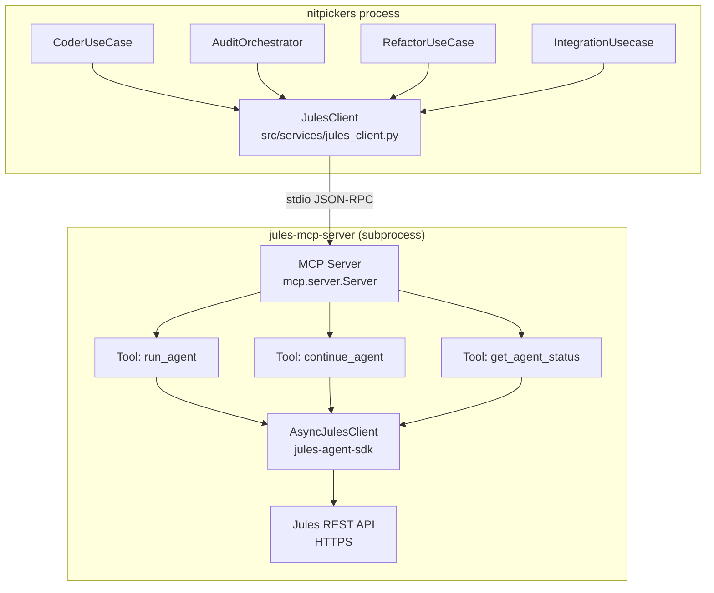
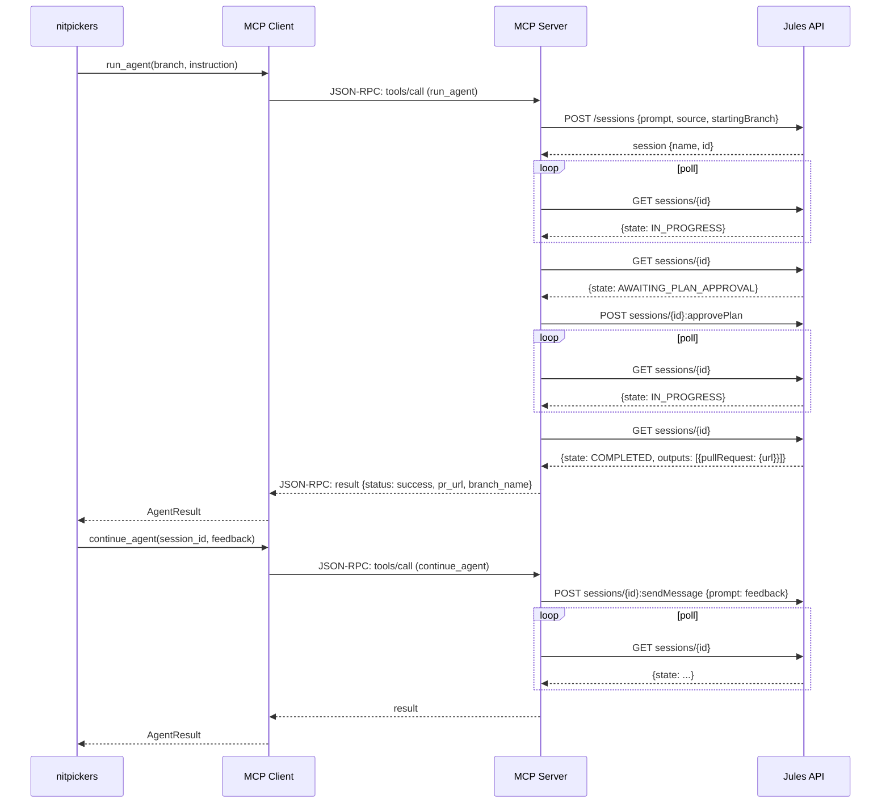
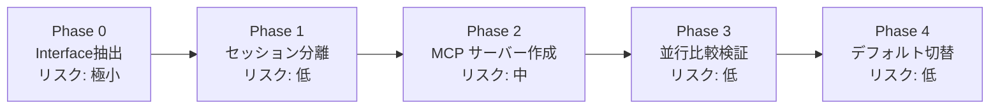
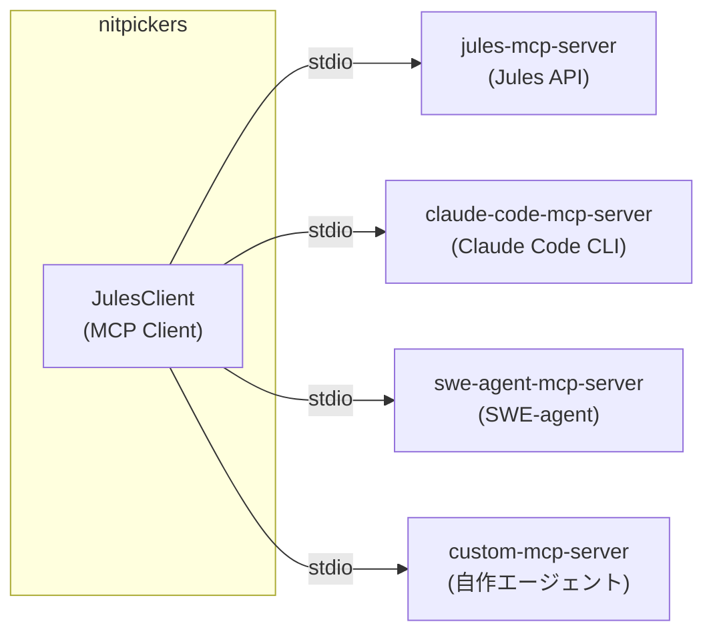

# JULES SDK → stdio MCP アーキテクチャ設計

## 1. 現状分析

### 1.1 現在の依存関係

```
nitpickers ──→ JulesClient ──→ jules-agent-sdk v0.1.1 ──→ Jules REST API
                 (src/services/jules_client.py)    (aiohttp)    (HTTPS)
                                                                   
                    ┌─────────────────────────────────────┐
                    │  JulesClient 公開メソッド              │
                    │                                      │
                    │  run_session()                       │
                    │  continue_session()                  │
                    │  wait_for_completion()               │
                    │  get_session_state()                 │
                    │  list_activities()                   │
                    │  send_message()                      │
                    │  approve_plan()                      │
                    │  get_latest_branch_commit()          │
                    │  create_master_integrator_session()  │
                    │  send_message_to_session()           │
                    └─────────────────────────────────────┘
```

### 1.2 コンシューマ一覧

| コンシューマ | 使用メソッド | 役割 |
|---|---|---|
| [`CoderUseCase`](src/services/coder_usecase.py:46) | `run_session`, `wait_for_completion`, `continue_session`, `get_session_state`, `get_latest_branch_commit`, `_send_message` | メインの実装パイプライン |
| [`AuditOrchestrator`](src/services/audit_orchestrator.py:23) | `run_session`, `wait_for_completion`, `list_activities`, `approve_plan`, `send_message` | プラン監査ループ |
| [`BaseJulesUseCase`](src/services/base_jules_usecase.py:20) | `run_session`, `get_latest_branch_commit` | CoderUseCase / RefactorUseCase の基底 |
| [`IntegrationUsecase`](src/services/integration_usecase.py:19) | `JulesClient()` 直接生成 | マージコンフリクト解決 |
| [`RefactorUseCase`](src/services/refactor_usecase.py:18) | `JulesClient()` 直接生成 | リファクタリング |
| [`GraphNodes`](src/graph_nodes.py:42) | `JulesClient()` 直接生成 | グラフノードへの注入 |
| [`WorkflowService`](src/services/workflow.py:42) | DI 経由 | トップレベルオーケストレーション |
| [`QAUsecase`](src/services/qa_usecase.py:25) | DI 経由 | QA パイプライン |
| [`AuditorUsecase`](src/services/auditor_usecase.py:27) | DI 経由 | 監査パイプライン |

## 2. stdio MCP の運用特性

### 2.0 なぜ stdio なのか

MCP のトランスポートには stdio と HTTP/SSE の2種類がある。stdio を選ぶ理由は**運用コストの低さ**にある。

| 項目 | HTTP/SSE | stdio (採用) |
|---|---|---|
| サーバー起動 | デーモン常駐 (`systemd`, `docker run`) | nitpickers が自動 spawn |
| ポート管理 | 空きポート確保・競合回避が必要 | 不要 |
| 認証 | API key / mTLS 等の仕組みが必要 | 不要（プロセス間通信） |
| ネットワーク設定 | ファイアウォール・リバースプロキシ | 不要（同一ホスト） |
| 死活監視 | ヘルスチェック必須 | プロセス有無のみ |
| 停止 | 明示的な stop / 削除 | nitpickers 終了時に自動 kill |

ユーザーからは **「MCP サーバーが動いている」という意識すら不要** になる。初期化時にサブプロセスが spawn され、終了時に自動クリーンアップされるため、今の `jules-agent-sdk` 直接利用とほぼ同じ運用感覚で移行できる。

```python
# ユーザーから見た操作感は今と変わらない
client = JulesClient()          # ← 裏で subprocess.spawn("jules-mcp-server")
result = await client.run_session(...)  # ← stdio JSON-RPC via subprocess
# 終了時に自動クリーンアップ
```

### 2.1 コア抽象化: Branch + Instruction → Result

ユーザーの洞察を反映：

```
入力: { branch: str, instruction: str, context?: Context }
出力: { status: str, pr_url?: str, branch_name?: str }
```

この抽象化により：
- JULES は `branch + instruction → PR` という実装の一つになる
- 将来的に別の開発基盤（Claude Code, OpenHands, SWE-agent 等）に差し替え可能
- インターフェースが単純でテスト容易

### 2.2 高レベルツール設計（推奨）

SDK の個別メソッドを 1:1 で MCP ツールにするのではなく、**ステートフルなワークフローを MCP サーバー側でカプセル化**する：

```
                    ┌──────────────────────────────────┐
                    │      MCP Server (jules-mcp)       │
                    │                                   │
                    │  ┌─ Tool: run_agent ───────────┐  │
                    │  │  branch + instruction  →    │  │
                    │  │  create session              │  │
                    │  │  wait for completion         │  │
                    │  │  handle plan approval        │  │
                    │  │  handle user feedback        │  │
                    │  │  return result                │  │
                    │  └──────────────────────────────┘  │
                    │                                   │
                    │  ┌─ Tool: continue_agent ──────┐  │
                    │  │  session_id + instruction → │  │
                    │  │  send message                │  │
                    │  │  wait for completion         │  │
                    │  │  return result                │  │
                    │  └──────────────────────────────┘  │
                    │                                   │
                    │  ┌─ Tool: get_agent_status ────┐  │
                    │  │  session_id → state info     │  │
                    │  └──────────────────────────────┘  │
                    │                                   │
                    │  (内部で jules-agent-sdk を使用)   │
                    └──────────────────────────────────┘
```

## 3. MCP インターフェース定義

### 3.1 ツール定義

#### Tool: `run_agent`

```json
{
  "name": "run_agent",
  "description": "Run a code agent on a git branch with an instruction. Creates a session, waits for completion, and returns the result.",
  "inputSchema": {
    "type": "object",
    "required": ["branch", "instruction"],
    "properties": {
      "branch": {
        "type": "string",
        "description": "Git branch name to work on"
      },
      "instruction": {
        "type": "string",
        "description": "Instruction/prompt for the agent"
      },
      "context_files": {
        "type": "array",
        "items": {"type": "string"},
        "description": "Read-only context file paths"
      },
      "target_files": {
        "type": "array",
        "items": {"type": "string"},
        "description": "Target file paths the agent may edit"
      },
      "require_plan_approval": {
        "type": "boolean",
        "description": "Whether to require plan approval before execution"
      }
    }
  }
}
```

#### Tool: `continue_agent`

```json
{
  "name": "continue_agent",
  "description": "Send a follow-up instruction to an existing agent session.",
  "inputSchema": {
    "type": "object",
    "required": ["session_id", "instruction"],
    "properties": {
      "session_id": {
        "type": "string",
        "description": "Session ID from a previous run_agent call"
      },
      "instruction": {
        "type": "string",
        "description": "Follow-up instruction for the agent"
      }
    }
  }
}
```

#### Tool: `get_agent_status`

```json
{
  "name": "get_agent_status",
  "description": "Get the current status of an agent session without waiting.",
  "inputSchema": {
    "type": "object",
    "required": ["session_id"],
    "properties": {
      "session_id": {
        "type": "string",
        "description": "Session ID to check"
      }
    }
  }
}
```

### 3.2 戻り値の型

```python
@dataclass
class AgentResult:
    status: str  # "success" | "running" | "failed" | "timeout"
    session_id: str
    pr_url: str | None = None
    branch_name: str | None = None
    error: str | None = None
```

## 4. アーキテクチャ図

### 4.1 全体構成



### 4.2 セッションライフサイクル



## 5. ファイル構成案

```
src/services/jules/
├── __init__.py
├── mcp_client.py          # NEW: MCP client wrapper (MCPClient)
├── context_builder.py     # 既存: プロンプト構築 (変更なし)
├── git_context.py         # 既存: Git コンテキスト (変更なし)

jules-mcp-server/           # NEW: 独立した MCP サーバープロジェクト
├── pyproject.toml          # 依存: jules-agent-sdk, mcp
├── src/jules_mcp_server/
│   ├── __init__.py
│   ├── __main__.py        # Entry point: python -m jules_mcp_server
│   ├── server.py          # MCP Server 定義, ツール登録
│   ├── session_manager.py # セッション管理・ポーリングロジック
│   └── config.py          # JulesConfig (API key, base_url)
```

## 6. JulesClient 変更計画

現在の [`JulesClient`](src/services/jules_client.py) を MCP クライアントにリファクタリング：

```python
# 変更前
from jules_agent_sdk import AsyncJulesClient

class JulesClient:
    def __init__(self, ...):
        self.sdk_client = AsyncJulesClient(api_key=..., base_url=...)
    
    async def run_session(self, ...):
        session = await self.sdk_client.sessions.create(...)
        ...
    
    async def wait_for_completion(self, ...):
        # 複雑なポーリングループ
        while True:
            session = await self.sdk_client.sessions.get(...)
            ...

# 変更後
class JulesClient:
    def __init__(self, mcp_server_cmd: str = "jules-mcp-server"):
        self._process: asyncio.subprocess.Process | None = None
        self._session: ClientSession | None = None
    
    async def _ensure_connection(self):
        if not self._session:
            params = StdioServerParameters(command=self.mcp_server_cmd)
            self._session = await stdio_client(params).__aenter__()
    
    async def run_session(self, instruction, branch, ...):
        await self._ensure_connection()
        result = await self._session.call_tool("run_agent", {
            "branch": branch,
            "instruction": instruction,
            ...
        })
        return self._parse_result(result)
    
    async def wait_for_completion(self, session_name, ...):
        # MCPサーバー側で既に完了まで待っているので、
        # ここでは単に get_agent_status を呼ぶだけ
        result = await self._session.call_tool("get_agent_status", {
            "session_id": session_name,
        })
        return self._parse_result(result)
```

**既存のコンシューマは変更不要** — `JulesClient` クラスの名前とメソッドシグネチャを維持するため。

## 7. MCP サーバーの実装詳細

### 7.1 サーバーエントリポイント

```python
# jules-mcp-server/src/jules_mcp_server/__main__.py
import anyio
from mcp.server import Server
from mcp.server.stdio import stdio_server

from .server import create_jules_server


async def main():
    server = create_jules_server()
    
    async with stdio_server() as (read_stream, write_stream):
        await server.run(
            read_stream,
            write_stream,
            server.create_initialization_options(),
        )

anyio.run(main)
```

### 7.2 ツール実装

```python
# jules-mcp-server/src/jules_mcp_server/server.py
from mcp.server import Server
from mcp.types import Tool as MCPTool
from mcp.types import TextContent, CallToolResult

from .session_manager import JulesSessionManager


def create_jules_server() -> Server:
    server = Server("jules-mcp")
    mgr = JulesSessionManager()
    
    @server.list_tools()
    async def list_tools() -> list[MCPTool]:
        return [
            MCPTool(
                name="run_agent",
                description="Run a code agent on a branch with instruction...",
                inputSchema={
                    "type": "object",
                    "required": ["branch", "instruction"],
                    "properties": {
                        "branch": {"type": "string"},
                        "instruction": {"type": "string"},
                        "context_files": {
                            "type": "array", "items": {"type": "string"}
                        },
                        "target_files": {
                            "type": "array", "items": {"type": "string"}
                        },
                        "require_plan_approval": {
                            "type": "boolean"
                        },
                    },
                },
            ),
            MCPTool(
                name="continue_agent",
                ...
            ),
            MCPTool(
                name="get_agent_status",
                ...
            ),
        ]
    
    @server.call_tool()
    async def call_tool(name: str, arguments: dict) -> CallToolResult:
        if name == "run_agent":
            result = await mgr.run_agent(**arguments)
        elif name == "continue_agent":
            result = await mgr.continue_agent(**arguments)
        elif name == "get_agent_status":
            result = await mgr.get_agent_status(**arguments)
        else:
            raise ValueError(f"Unknown tool: {name}")
        
        return CallToolResult(
            content=[TextContent(type="text", text=json.dumps(result))]
        )
    
    return server
```

### 7.3 内部でカプセル化するロジック

MCP サーバー側に移すロジック（現在 [`JulesClient.wait_for_completion()`](src/services/jules_client.py:172) にあるもの）：

- セッション状態ポーリングループ
- スケール検出（stale session detection）＋ナッジ送信
- プラン承認フロー（`PlanAuditor` 呼び出し含む）
- ユーザーフィードバックハンドリング
- タイムアウト管理
- セッション障害からのリカバリー

## 8. 段階的移行計画（推奨）

一気に MCP 化するのはリスクが高い。[`JulesClient.wait_for_completion()`](src/services/jules_client.py:172) は200行超の複雑なステートマシン（ポーリング・スケール検出・ナッジ・プラン承認・フィードバック応答・タイムアウト・リカバリー）を含むため、段階的に検証しながら進める。



### Phase 0: Interface 抽出（影響範囲: 新規ファイル + [`jules_client.py`](src/services/jules_client.py) のみ）

**目的**: JulesClient の契約（contract）を明示的に定義する。振る舞いは一切変えない純粋リファクタリング。

1. [`src/services/agent_protocol.py`](src/services) に `AgentProtocol` (Protocol クラス) を定義
2. [`JulesClient`](src/services/jules_client.py) が `AgentProtocol` を実装していることを明示
3. 全コンシューマは引き続き `JulesClient` を使う（変更不要）

```python
# src/services/agent_protocol.py (NEW)
class AgentProtocol(Protocol):
    async def run_session(
        self, session_id: str, prompt: str,
        target_files: list[str] | None = None,
        context_files: list[str] | None = None,
        require_plan_approval: bool = False,
        branch: str | None = None,
    ) -> dict[str, Any]: ...

    async def continue_session(
        self, session_name: str, prompt: str
    ) -> dict[str, Any]: ...

    async def wait_for_completion(
        self, session_name: str, ...
    ) -> dict[str, Any]: ...

    async def get_session_state(self, session_id: str) -> str: ...
    async def list_activities(self, session_id: str) -> list[Any]: ...
    async def send_message(self, session_id: str, content: str) -> None: ...
    async def approve_plan(self, session_id: str, plan_id: str | None = None) -> None: ...
    async def get_latest_branch_commit(self, branch_name: str) -> str: ...
```

**検証**: 既存テストが全て通れば OK。振る舞い変更なし。

### Phase 1: セッション管理ロジックの分離（影響範囲: [`src/services/jules/`](src/services/jules) のみ）

**目的**: 複雑なポーリングループを独立したクラスに抽出し、テスト容易にする。このクラスは後ほど MCP サーバー側でも再利用する。

1. [`src/services/jules/session_monitor.py`](src/services/jules) に `SessionMonitor` クラスを作成
2. ポーリング・スケール検出・ナッジ・プラン承認のロジックを `JulesClient` から移動
3. `JulesClient` は `SessionMonitor` を内部で利用

```python
# src/services/jules/session_monitor.py (NEW)
class SessionMonitor:
    """ポーリング・スケール検出・プラン承認のロジックをカプセル化"""
    async def wait_for_completion(
        self, sdk_client, session_name: str, ...
    ) -> dict[str, Any]:
        # ここに JulesClient.wait_for_completion の200行
        ...
```

**検証**: 既存の統合テスト（`tests/integration/`）が通れば OK。

### Phase 2: MCP サーバー作成（影響範囲: 新規プロジェクトのみ）

**目的**: [`jules-mcp-server/`](src) を独立したプロジェクトとして作成。nitpickers 側は一切変更しない。

1. `jules-mcp-server/` ディレクトリ作成
2. MCP ツール `run_agent` / `continue_agent` / `get_agent_status` 実装
3. 内部で `jules-agent-sdk` + Phase 1 の `SessionMonitor` 相当のロジックを使用
4. 単体でテスト可能（モク Jules API に対して）

**検証**: MCP サーバー単体のテストで OK。nitpickers には影響なし。

### Phase 3: 並行比較検証（影響範囲: [`jules_client.py`](src/services/jules_client.py) のみ）

**目的**: SDK 実装と MCP 実装を共存させ、実際の JULES セッションで結果を比較する。

1. Protocol の MCP 実装 (`JulesMCPClient`) を作成
2. 比較モード付き `ComparingClient` を実装（両方呼んで結果の差分をログ出力）

```python
class JulesClient(AgentProtocol):
    def __init__(self, backend: str = "sdk"):
        if backend == "sdk":
            self._impl = JulesSDKClient()    # 従来
        elif backend == "mcp":
            self._impl = JulesMCPClient()    # 新規
        elif backend == "compare":           # 並行比較
            self._impl = ComparingClient(
                JulesSDKClient(), JulesMCPClient()
            )
```

3. `compare` モードで実際の開発サイクルを回し、結果の一致を検証
4. 差分があれば MCP 側を修正

**検証**: 実際の JULES セッションで SDK と MCP の結果が一致することを確認。

### Phase 4: デフォルト切替（影響範囲: [`config.py`](src/config.py) のみ）

**目的**: デフォルトを MCP に変更。問題があれば即座に SDK に戻せる。

1. 設定のデフォルト値を `sdk` → `mcp` に変更
2. `sdk` バックエンドは fallback として維持
3. 運用開始

**検証**: 通常の CI/CD パイプラインで確認。

## 9. 将来の拡張性

同じ MCP インターフェースで異なるバックエンドに切り替え可能：



各 MCP サーバーが同じツールインターフェース (`run_agent`, `continue_agent`, `get_agent_status`) を実装すれば、nitpickers 側のコード変更なしでバックエンドを切り替えられる。

## 10. 注意点・リスク

| リスク | 対策 |
|---|---|
| MCP サーバー起動のオーバーヘッド | サーバーは `JulesClient` 初期化時に一度だけ起動し、セッション使い回し |
| JSON-RPC シリアライズコスト | 大きなプロンプト（100KB+）でも JSON シリアライズはミリ秒単位で問題なし |
| プロセス管理（クラッシュ・再起動） | `JulesClient` にヘルスチェック＆自動再起動ロジックを追加 |
| 複数 MCP サーバーの共存 | 設定でコマンドを切り替え可能に（デフォルト: `jules-mcp-server`） |
