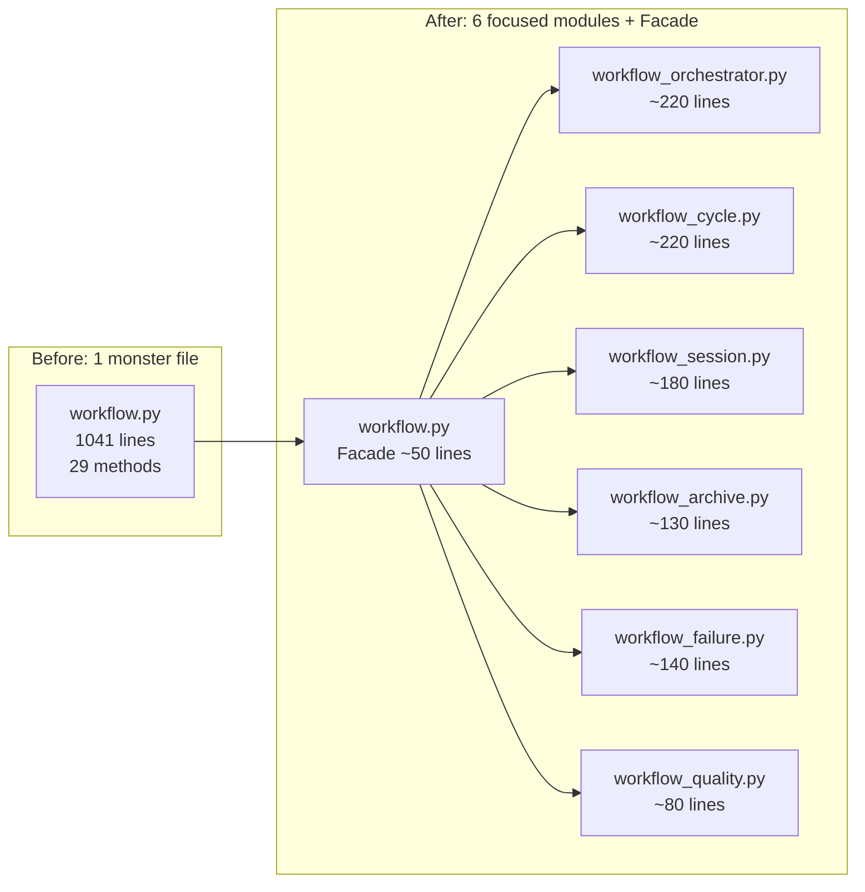

# WorkflowService 分割計画

> **目標**: `src/services/workflow.py` (1041行) を機能別に6モジュールに分割
> **方式**: Mixin継承 + Facadeパターン — 既存の `from src.services.workflow import WorkflowService` を維持
> **リスク**: 低〜中。テストのpatchパスはすべて維持される。

---

## 1. 現状分析

### `WorkflowService` が持つ責務 (全17メソッド)

| # | メソッド | 行数 | 責務カテゴリ |
|---|----------|------|-------------|
| 1 | `run_gen_cycles()` | 103 | アーキテクチャ生成オーケストレーション |
| 2 | `run_cycle()` | 19 | サイクル実行エントリポイント |
| 3 | `run_full_pipeline()` | 20 | 5-Phase パイプライン統合 |
| 4 | `_run_parallel_coder_phase()` | 42 | Phase 2 並列実行 |
| 5 | `run_integration_phase()` | 30 | Phase 3 統合 |
| 6 | `run_qa_phase()` | 29 | Phase 4 QA |
| 7 | `_run_all_cycles()` | 48 | 全サイクル逐次/並列実行 |
| 8 | `_check_cycle_completion()` | 10 | サイクル完了チェック |
| 9 | `_execute_cycle_graph()` | 68 | LangGraph サイクル実行 |
| 10 | `_run_single_cycle()` | 76 | 単一サイクル (worktree設定含む) |
| 11 | `_setup_cycle_workspace()` | 22 | Git Worktree 分離 |
| 12 | `start_session()` | 50 | Jules セッション開始 |
| 13 | `finalize_session()` | 71 | セッション終了 + PR作成 |
| 14 | `generate_tutorials()` | 63 | QAチュートリアル生成 |
| 15 | `_save_failure_snapshot()` | 89 | 障害診断スナップショット + RCA起動 |
| 16 | `_serialize_state_data()` | 33 | 状態シリアライズ |
| 17 | `_get_llm_optimized_state()` | 13 | LLM用状態トランケーション |
| 18 | `_archive_and_reset_state()` | 28 | アーカイブオーケストレーション |
| 19 | `_get_next_phase_num()` | 11 | フェーズ番号検出 |
| 20 | `_archive_files()` | 24 | ファイルアーカイブ |
| 21 | `_reset_project_state()` | 6 | 状態リセット |
| 22 | `_prepare_next_phase()` | 4 | 次フェーズ準備 |
| 23 | `_commit_archived_phase()` | 7 | アーカイブコミット |
| 24 | `_safe_move_item()` | 13 | ファイル移動ヘルパー |
| 25 | `_get_quality_gate_cmds()` | 12 | 品質ゲートコマンド取得 |
| 26 | `_handle_global_refactor_result()` | 61 | グローバルリファクタリング結果処理 |
| 27 | `_update_cycle_status()` | 5 | サイクルステータス更新 |
| 28 | `verify_environment_and_observability()` | 5 | 環境検証 (alias) |
| 29 | `_get_manifest()` | 3 | マニフェスト読み込み |

### 呼び出し元

- **`src/cli.py`**: `WorkflowService()` → `.run_gen_cycles()`, `.run_cycle()`, `.run_full_pipeline()`, `.run_integration_phase()`, `.run_qa_phase()`, `.finalize_session()`
- **テスト**: `"src.services.workflow.WorkflowService._run_single_cycle"`, `"src.services.workflow.WorkflowService.verify_environment_and_observability"` をpatch

---

## 2. 分割設計

### 2.1 モジュール構成

```
src/services/
├── workflow.py                  # Facade: 既存のWorkflowService (importパス維持)
├── workflow_orchestrator.py     # パイプラインオーケストレーション  (~220行)
├── workflow_cycle.py            # サイクル実行 + Worktree管理         (~220行)
├── workflow_session.py          # セッション開始/終了/PR作成          (~180行)
├── workflow_archive.py          # アーカイブ + フェーズ管理            (~130行)
├── workflow_failure.py          # 障害スナップショット + シリアライズ (~140行)
└── workflow_quality.py          # 品質ゲート + リファクタリング        (~80行)
```

### 2.2 責務分割詳細

#### [`workflow_orchestrator.py`](src/services/workflow_orchestrator.py) — Pipeline Orchestration

```python
class WorkflowOrchestrator:
    """Phase orchestration and pipeline execution."""

    def run_gen_cycles(self, cycles, project_session_id, auto_run=False) -> None
    def run_cycle(self, cycle_id, resume, auto, start_iter, project_session_id, parallel=False) -> None
    def run_full_pipeline(self, project_session_id=None, parallel=True, resume=False) -> None
    def run_integration_phase(self, project_session_id=None) -> None
    def run_qa_phase(self, project_session_id=None) -> None
    def verify_environment_and_observability(self) -> None
    def generate_tutorials(self, project_session_id) -> None

    # Internal
    def _run_parallel_coder_phase(self, project_session_id, parallel, resume=False) -> None
    def _run_all_cycles(self, resume, auto, start_iter, project_session_id, parallel=False) -> None
```

**依存**: `self.services`, `self.builder`, `self.git`

---

#### [`workflow_cycle.py`](src/services/workflow_cycle.py) — Cycle Execution

```python
class WorkflowCycleExecutor:
    """Single cycle execution with worktree isolation."""

    # Internal
    def _run_single_cycle(self, cycle_id, resume, auto, start_iter, project_session_id) -> bool | None
    def _execute_cycle_graph(self, cycle_id, start_iter, resume, pid, fb, ib, planned_count, git_manager=None) -> bool
    def _setup_cycle_workspace(self, cycle_id, fb, wt_mgr_cls, git_mgr_cls, lock) -> tuple
    def _check_cycle_completion(self, cycle_id) -> bool
    def _update_cycle_status(self, cycle_id) -> None
    def _get_manifest(self) -> Any
```

**依存**: `self.services`, `self.builder`, `self.git`, `self._background_tasks`

---

#### [`workflow_session.py`](src/services/workflow_session.py) — Session Management

```python
class WorkflowSessionManager:
    """Start/finalize Jules sessions and create PRs."""

    def start_session(self, prompt, audit_mode, max_retries) -> None
    def finalize_session(self, project_session_id=None) -> None
```

**依存**: `self.services`, `self.builder`, `self.git`

---

#### [`workflow_archive.py`](src/services/workflow_archive.py) — Archiving

```python
class WorkflowArchiver:
    """Session artifact archiving and phase transitions."""

    # Internal
    def _archive_and_reset_state(self) -> None
    def _get_next_phase_num(self, docs_dir) -> int
    def _safe_move_item(self, src, dest) -> None
    def _archive_files(self, docs_dir, phase_dir) -> None
    def _reset_project_state(self, phase_dir) -> None
    def _prepare_next_phase(self, docs_dir) -> None
    def _commit_archived_phase(self, next_phase_num) -> None
```

**依存**: `self.git`

---

#### [`workflow_failure.py`](src/services/workflow_failure.py) — Failure Handling

```python
class WorkflowFailureHandler:
    """Diagnostic snapshot and state serialization."""

    def _save_failure_snapshot(self, cycle_id, state, error_msg, git_manager=None) -> None
    def _serialize_state_data(self, state) -> dict
    def _get_llm_optimized_state(self, state) -> dict
```

**依存**: `self.git`, `self._background_tasks`

---

#### [`workflow_quality.py`](src/services/workflow_quality.py) — Quality Gates

```python
class WorkflowQualityManager:
    """Quality gate commands and refactoring result handling."""

    def _get_quality_gate_cmds(self) -> list[list[str]]
    def _handle_global_refactor_result(self, result, git) -> None
```

**依存**: なし (スタティックメソッドに近い)

---

### 2.3 Facade: [`workflow.py`](src/services/workflow.py)

```python
"""WorkflowService — Facade composed from specialized workflow modules."""
from src.services.workflow_orchestrator import WorkflowOrchestrator
from src.services.workflow_cycle import WorkflowCycleExecutor
from src.services.workflow_session import WorkflowSessionManager
from src.services.workflow_archive import WorkflowArchiver
from src.services.workflow_failure import WorkflowFailureHandler
from src.services.workflow_quality import WorkflowQualityManager


class WorkflowService(
    WorkflowOrchestrator,
    WorkflowCycleExecutor,
    WorkflowSessionManager,
    WorkflowArchiver,
    WorkflowFailureHandler,
    WorkflowQualityManager,
):
    """Facade class that composes specialized workflow modules via MRO.

    All public API methods (run_gen_cycles, run_cycle, run_full_pipeline, etc.)
    are inherited from the respective base classes. __init__ is defined here
    to set shared instance attributes accessed by all base classes.
    """

    def __init__(self, services: ServiceContainer | None = None) -> None:
        self.services = services or ServiceContainer.default()
        self.builder = GraphBuilder(self.services, self.services.jules)
        self.git = GitManager()
        self._background_tasks: set[asyncio.Task[Any]] = set()
```

---

## 3. 移行手順

### Step 1: Extract base classes (新規ファイル作成)

1. `src/services/workflow_orchestrator.py` — パイプライン系メソッドを移動
2. `src/services/workflow_cycle.py` — サイクル系を移動
3. `src/services/workflow_session.py` — セッション系を移動
4. `src/services/workflow_archive.py` — アーカイブ系を移動
5. `src/services/workflow_failure.py` — 障害系を移動
6. `src/services/workflow_quality.py` — 品質系を移動

各ファイルは:
- 必要なimportのみ記述
- クラスは `self.services`, `self.builder`, `self.git`, `self._background_tasks` に依存 (これらは `WorkflowService.__init__` で設定される)

### Step 2: `workflow.py` をFacade化

- 元の全メソッドを削除
- 6つのMixinクラスを継承
- `__init__` のみ維持

### Step 3: テスト実行

```bash
pytest tests/unit/ tests/integration/ tests/e2e/test_coder_graph.py tests/e2e/test_architect_graph.py tests/e2e/test_qa_graph.py -v
```

### Step 4: クリーンアップ

- `__init__.py` のエクスポート確認
- 不要になったimportの削除確認

---

## 4. リスク評価

| リスク | 影響 | 対策 |
|--------|------|------|
| Mixin MRO 衝突 | 低 | 全mixinは `__init__` を持たない。メソッド名の重複なし |
| テストpatchパス | 低 | `src.services.workflow.WorkflowService.method` はMRO解決後も同じパス |
| circular import | 低 | Facadeが子モジュールをimport→子はFacadeをimportしない |
| `self._background_tasks` の参照 | 低 | 全mixinがアクセス可能 (`WorkflowFailureHandler` と `WorkflowCycleExecutor` で使用) |
| `_run_all_cycles` 内で `generate_tutorials` を呼ぶ | 低 | 同一クラス内のメソッド呼び出し — MROで解決 |

---

## 5. 期待される成果

| 指標 | 現状 | 分割後 |
|------|------|--------|
| `workflow.py` 行数 | 1041行 | ~50行 (Facade) |
| モジュール数 | 1 | 7 |
| 最大モジュール行数 | 1041行 | ~220行 |
| テスト互換性 | — | 100%維持 |
| CLI import パス | `from src.services.workflow import WorkflowService` | 変更なし |

---

## 6. 差分概要


